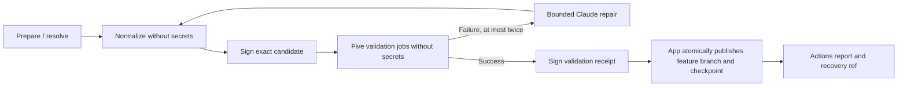

# Native metadata branch synchronization

This controller automatically publishes a validated replacement for
`grafana/mimir-prometheus:arve/parquet-metadata-resource-attributes` from the
same branch in `aknuds1/prometheus`, rebased onto Mimir's current `main`.
It never writes to the upstream repository. The implementation is a standalone,
standard-library-only Go module; use `GOWORK=off` for its development commands.

Scheduled execution is disabled unless the repository variable
`NATIVE_METADATA_SYNC_ENABLED` is exactly `true`. Manual preparation defaults
to a dry run. Deployment, account setup, paid API acceptance, and enabling the
schedule are operator tasks; this change does not provision them.

## History contract

The checked-in bootstrap records the reviewed source-to-fork mapping: 59 source
commits, including 36 projections conservatively marked as adapted, followed by
three local overlays.
Its original target is `63444c6fd6f47b5cc61496fd0a2227d2d62a4513`.
Before first publication, that target must still be an ancestor of the feature
branch, and the old source commit
`ff9a2c57061e3b00a0705de63ce51254c23b7190` must remain fetchable.

On later runs, a signed applied checkpoint replaces the bootstrap. Linear human
commits appended to the target become additional overlays. A rewritten target
or a nonlinear source series stops preparation for manual integration.

For unchanged source commits, replay uses the previous fork projection. A
rewritten source commit can reuse a projection only when its complete raw Git
delta (paths, modes, old/new blobs) has one unique exact match in each series.
Range diffs are diagnostic only. A source rewrite gets a fresh,
unique merge base against a pinned `prometheus/prometheus:main`; unrelated work
between that base and Mimir's main is reported, not imported as feature work.

Adaptation detection also compares exact raw deltas, preserving whitespace inside
string literals and other meaningful differences. A reused projection retains any
known adaptation flag. Previously stored false flags are corrected in memory when
their deltas differ; signed checkpoints remain unchanged. Differences in base-file
content can conservatively mark more projections as adapted. Reused projections
need no reconciliation calls; unreused ones remain subject to the API budget and
editable-file restrictions.

Every unreused prior adaptation requires an explicit Claude disposition:
retained, superseded by new source behavior, or removed with the feature.
Conflict and repair edits must name scoped regular files, match their hashes,
and use unique nonoverlapping replacements. Binary, symlink, rename, and
delete conflicts require manual integration. Automation paths and dependency
files cannot be edited by the model. Test removal and added skips are rejected;
validation cannot prove semantic correctness or test strength. Failed or unsupported
integration requires human intervention.

Source commit boundaries, authors, author dates, messages, and empty commits
are preserved. Fork adjustments remain projections and separate integration
commits. Every rewritten commit gets the configured signing identity's DCO
sign-off and SSH signature. Only the final candidate tree must pass validation;
intermediate upstream draft commits need not build independently.

## Pipeline



The validation matrix runs normal Go tests, label/direct-I/O variants with
selected race tests, lint, generated-file checks, and UI build/lint/tests.
Generation failures during normalization are deferred to the mandatory generated
validation job so compilation errors can enter the bounded repair loop. Partial
generated changes are signed and tested; a normalization job is not a success gate.
Generation covers module tidy, CLI docs, feature test data, OpenAPI goldens,
and protobuf checks. Go formatting runs in the trusted controller.
Candidate code executes only in normalization and validation jobs. Normalizers
return a patch restricted to an explicit generated-file allowlist; they cannot
replace the trusted manifest or commit graph. All execution uses fresh hosted
runners without shared GitHub Actions cache access.

Signing happens before the final validation matrix. A signed envelope binds
its exact candidate. The receipt records all five successful job IDs from the
same original workflow attempt and selected repair round. The controller checks
the GitHub jobs API, workflow path, control SHA, run attempt, and exact job names.
Earlier failed repair rounds do not invalidate a later successful round;
GitHub may still display their failed jobs in the overall run.

The final publisher consumes the exact artifact ID and signed envelope emitted
by `seal`. It checks repository, workflow, original run attempt, controller SHA,
all five recorded job IDs, and current automation policy before changing refs.
Missing, expired, substituted, or malformed input stops publication. The App token
is minted only after the controller is built and the sealed artifact is downloaded.
Publication is automatic for enabled scheduled runs and manual runs with
`dry_run: false`. There are no sync PRs or approval checks.

The publisher atomically updates the feature branch and applied checkpoint using
explicit old-value leases, together with immutable candidate, receipt, and recovery
refs. A target or checkpoint race rejects the whole push. Later human commits are
preserved and become overlays in the next sync. Only the dedicated feature branch
and `bot/native-metadata-sync/**` refs can be written; main and the source repository
are never publication targets.

The signed receipt retains the candidate, captured old target, current/previous
source tips, and previous checkpoint as commit parents. Its tree contains only
`manifest.json`.

## Retry, cancellation, and reporting

Pipeline work uses cancellation-aware guards. Preparation, normalization, signing,
validation, and repair run only in attempt 1. To retry a transient publication
failure, rerun **only the publish job**, for example `gh run rerun --job JOB_ID`.
It reuses the original sealed artifact and reads validation through the explicit
attempt-1 API endpoints. It never reruns Claude. Do not use “Re-run all jobs” or
“Re-run failed jobs”; earlier repair failures may be included. Other stage failures,
expired artifacts, stale targets, or changed policy require a fresh workflow run.

An immutable receipt and its matching candidate/recovery refs prove historical
publication. A retry returns `already-published` without changing Git refs or
querying Actions again, even after human commits, another sync, or an intentional
rollback. This status does not claim the feature branch still points to that
candidate. Missing or conflicting supporting refs stop the controller.

Cancellation or a broken connection can occur after the server accepted a push.
The controller checks the receipt before reporting `published`; otherwise the
outcome remains `unknown`. Absence of a receipt immediately after an interrupted
push does not establish that the push failed. Retry the publisher to reconcile;
there is no automatic rollback. A reporting failure after publication also does
not undo the update, and the controller logs its publication outcome first.

Actions summaries and report artifacts contain commit IDs, a bounded integration
diff and range diff, adaptation details, validation links, Claude spend, and receipt
and recovery refs. The sealed artifact retains the complete signed manifest and
Git bundle. Summary outcomes distinguish disabled scheduling, unchanged inputs,
validated dry runs, publication, and failure/uncertainty. Earlier failed repair
rounds may leave the overall workflow red even after a successful publication;
consult the publication outcome and receipt.

All runs share one non-cancelling concurrency queue. Unchanged applied inputs need
no new Claude work. Failed publication can be retried without preparation while its
artifact remains available; a fresh run has a new budget.

## Credentials and operator setup

Deploy the implementation to `main` before using the entrypoint workflows.
Configure these repository variables:

| Variable | Value |
| --- | --- |
| `SYNC_BOT_NAME` | Commit signing account's display name. |
| `SYNC_BOT_EMAIL` | Verified email belonging to that account. |
| `SYNC_SIGNING_PUBLIC_KEY` | The complete `ssh-ed25519` public signing key. |
| `NATIVE_METADATA_SYNC_ENABLED` | Leave unset or `false` until acceptance. |

Use a dedicated signing account and register its public key as a **signing key**
on GitHub if GitHub's Verified badge is required. The App that pushes Git refs is
separate from this commit signing identity. The controller verifies the exact
configured public key itself; an installation token does not sign Git commits.

Create these environments, restricted to the repository's `main` branch, without
required reviewers or other protection rules requiring human approval:

| Environment | Credentials delivered to its steps |
| --- | --- |
| `native-metadata-sync-resolve` | `ANTHROPIC_API_KEY` fetched from Vault; no GitHub environment secret required. |
| `native-metadata-sync-sign` | `SYNC_SIGNING_PRIVATE_KEY` only; an unencrypted Ed25519 private signing key. |
| `native-metadata-sync-publish` | Vault/OIDC authorization for the existing `mimir-github-bot` App token. |

The Anthropic key lives in the **ops** Vault instance, in the `ci` secrets engine
at `repo/grafana/mimir-prometheus/native-metadata-sync-anthropic-key`, field
`ANTHROPIC_API_KEY`. Use an ordinary API key in Anthropic's **Default workspace**
with access to the configured `claude-opus-5-5` model; Admin API access is not needed.
The pinned `get-vault-secrets` action reads it through repository OIDC in
`prepare`, `repair-1`, and `repair-2`, after building the trusted controller and
downloading inputs. Only the immediately following resolver step receives the
key in its environment. Failed Vault reads or empty keys stop that job before
the controller runs. The key is not a job output or an artifact.

The standard CI Vault policy grants repository-scoped access to
`ci/data/repo/grafana/mimir-prometheus/*`, not environment-scoped access. Other
trusted jobs with OIDC permission can also read this path. Main-only GitHub
environments gate job execution; the workflow limits key delivery to resolver
steps. Normalization, validation, and signing jobs have no OIDC permission.

Configure the shared App-token action's `native-metadata-sync` permission set.
The broker-issued token must be limited to `grafana/mimir-prometheus`, with
contents and workflows write access plus metadata read access. Workflow permission
is needed to transport history containing workflow files. Pull-request and Actions
permissions are not needed on the App token.

The `publish` command requires two step-scoped credentials: `GH_TOKEN` is the App
token used explicitly by Git; `GITHUB_TOKEN` is the built-in token used for read-only
Actions validation. The artifact download also uses the built-in token with an
explicit repository/run ID, including on publisher retries. The publisher requests
job-level `contents: read`, `actions: read`, and `id-token: write`. Missing credentials
or failed validation reads stop new publication without credential fallback.
Both inherited token variables are stripped from subprocess environments.
The `seal` step uses only `GITHUB_TOKEN` for Actions reads; preparation needs no
GitHub API token or PR/Actions permissions.

Restrict the Vault role to the sync workflow, this repository, `refs/heads/main`,
and the publish environment. Resolver and App jobs request OIDC tokens. The
broker's default repository-wide subject pattern would also admit resolver jobs,
so binding the App role to the publish environment is required before activation.

In `deployment_tools`, configure this one entry in
`terraform/repositories/mimir-prometheus/github-app-configs/config.yaml`,
preserving unrelated entries:

```yaml
workflows:
  - name: Native metadata sync publication
    path: .github/workflows/sync-native-metadata.yml
    app: mimir-github-bot
    oidc_subject: repo:grafana/mimir-prometheus:environment:native-metadata-sync-publish
    permission-sets:
      native-metadata-sync:
        branch: main
        event_name: [schedule, workflow_dispatch]
        repositories: [mimir-prometheus]
        permissions:
          contents: write
          workflows: write
          metadata: read
```

This subject matches the repository's default GitHub OIDC subject format for
environment jobs. Recheck the binding if that format changes. Apply the broker
configuration through Atlantis before merging the `deployment_tools` PR, then
verify its environment restrictions during operator acceptance. The workflow
changes do not provision it. App tokens are minted after building the trusted
controller and downloading inputs.

Restrict `bot/native-metadata-sync/**` updates and deletion to this App. The
controller creates immutable refs once and only advances `state`. Permit leased
force updates of the feature branch by the App, preserving ordinary human pushes
and required signed commits. The workflow/controller remain on trusted main;
the prototype feature code remains on its dedicated branch.

| Ref below `bot/native-metadata-sync/` | Purpose |
| --- | --- |
| `candidate/<candidate SHA>` | Immutable signed candidate tip. |
| `receipt/<receipt ID>` | Immutable signed manifest proving atomic publication. |
| `state` | Last applied receipt, advanced atomically with the feature branch. |
| `recovery/<receipt ID>` | Target tip immediately before publication. |

Raw source history is retained as metadata parents, never pushed as executable
branch tips. Candidate tips must match trusted main for protected automation paths.
Retain receipt, candidate, and recovery refs; they support historical retries.
Cleanup is deliberately manual.

To recover, first disable scheduled preparation and cancel/drain queued or active
runs. Reconcile any interrupted publisher before changing refs. Inspect the recovery
ref and previous-state field, then atomically restore the feature branch and state
with explicit leases (delete state when restoring the bootstrap). Do not restore
only the feature branch. Keep immutable receipts: retrying the old publisher must
recognize its historical completion rather than reverse the recovery. Resolve the
underlying integration problem before enabling scheduling again.

## API budget

The fixed model is `claude-opus-5-5`, with explicit high effort, streamed
structured JSON output, standard service, 32,768 output tokens, no prompt cache,
no tools, and global routing. High effort retains the previous setting;
quality, cost, and latency can differ between models.
The implementation uses the documented $4/input-million and $20/output-million
rates. Thinking tokens count toward output usage. Each request reserves $6.10
before sending. This conservative reservation covers the entire 1M context and
output limit and stays unchanged for compatibility with existing ledgers.
Historical actual charges remain unchanged. Valid usage from a complete response
replaces its reservation, even for refusals, output-limit stops, or invalid
structured output. Lost or interrupted responses and missing or invalid usage
retain the full reservation. Up to 40 attempts and $50 total charged/reserved are
shared across preparation and both repair rounds. Each HTTP retry needs a new
reservation. Pricing/model changes require updating this trusted policy before
enabling them.

The ledger is persisted before every call and uploaded on ordinary resolution
failure. Artifacts are retained for 30 days. Runner loss can prevent artifact
upload; reruns still cannot resume spending. Use Anthropic's account/project
limits for an independent aggregate spend cap across newly dispatched runs.
There are no paid requests in the local test suite.

## Acceptance and operation

1. Run the local checks below and review the bootstrap map. Confirm that the
   environments are restricted to `main` without human approval gates, and verify
   App permissions, namespace/branch rules, and signing-key registration.
2. Verify Vault key retrieval from `native-metadata-sync-resolve`, rejection of
   App-token requests from that environment, and successful token retrieval from
   `native-metadata-sync-publish`. Do not print keys or tokens. These checks verify
   deployed policy; local fixtures cannot establish it. Apply broker configuration
   through Atlantis before merging its PR.
3. Dispatch on `main` with `dry_run: true`. Verify the signing identities, exact
   validation job names/IDs, reports, adaptation dispositions, and spend. All five
   checks must run on the signed candidate. A dry run can use Claude but creates
   no remote refs and does not mint an App token.
4. Exercise conflict resolution and bounded repair in controlled acceptance;
   confirm budget continuity and that candidate execution cannot access resolver,
   signing, Vault, or shared cache credentials.
5. Dispatch with `dry_run: false` and verify automatic publication without approval.
   Check the feature tip, state, immutable receipt/candidate refs, and recovery ref.
   Rerun only the publisher to verify original artifact/output availability, attempt-1
   validation reads, and idempotence. Verify retry still preserves a later human
   commit. Check cancellation and stale-target rejection in controlled acceptance.
6. Enable `NATIVE_METADATA_SYNC_ENABLED=true` only after acceptance. Scheduling is
   weekdays at 05:23 UTC and best effort. Setting the variable false pauses future
   scheduled preparation; cancel/drain active runs when stopping or recovering.
   Manual runs remain available and default to a dry run.

Unsupported conflicts, policy failures, stale state, exhausted budget, or failure
of both repair rounds stop publication. Inspect logs/artifacts, integrate manually
when needed, and start a fresh run. Change protected automation through main.
Provisioning, acceptance, merging, and activation are operator tasks.

## Local verification

From `tools/native-metadata-sync`:

```sh
GOWORK=off go test -race ./...
GOWORK=off go vet ./...
GOWORK=off golangci-lint run ./...
bash check-workflows.sh
GOWORK=off go run . bootstrap-check \
  --repo /path/to/existing/feature-checkout \
  --work /tmp/fresh-bootstrap-verification
```

The bootstrap check performs a complete offline replay and compares the final
tree. It does not run each draft commit's tests. Unit/integration tests use
temporary real Git repositories, ephemeral signing keys, and in-process HTTP
transports to cover rewrites, reconciliation, safe edits, signed bundles,
budget accounting, validation provenance, atomic leases, receipts, and retries.
Run the repository's `make lint` as well.

`check-workflows.sh` ignores only actionlint 1.7.12's unknown-key diagnostics for
`cache-mode` and `concurrency.queue`. Both are supported GitHub syntax; keep the
settings and remove those two exceptions once actionlint supports them.

References: [GitHub cache access](https://docs.github.com/en/actions/reference/workflows-and-actions/dependency-caching),
[concurrency queues](https://docs.github.com/en/actions/how-tos/write-workflows/choose-when-workflows-run/control-workflow-concurrency),
[Claude Opus 5.5 migration](https://platform.claude.com/docs/en/models/opus-5-5/migration-guide),
and [Claude pricing](https://platform.claude.com/docs/en/about-claude/pricing).
